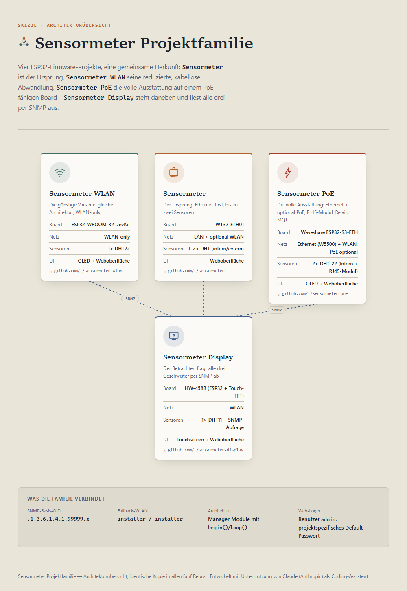

# Sensormeter PoE

<picture>
  <source media="(prefers-color-scheme: dark)" srcset="docs/projektfamilie-dark.png">
  <source media="(prefers-color-scheme: light)" srcset="docs/projektfamilie-light.png">
  
</picture>

ESP32-S3-basierter Umweltsensor (2× DHT-22, OLED SH1107) auf dem
**Waveshare ESP32-S3-ETH** (W5500-Ethernet + WLAN, optionales
PoE-Huckepack-Modul). Vierter Familienzweig neben
[Sensormeter](https://github.com/peterhagelhof7-cmd/sensormeter)
(WT32-ETH01),
[Sensormeter WLAN](https://github.com/peterhagelhof7-cmd/sensormeter-wlan)
(ESP32-WROOM-32) und
[Sensormeter Display](https://github.com/peterhagelhof7-cmd/sensormeter-display)
(Touchscreen-Betrachter) - übernimmt deren vollen Funktionsumfang 1:1, plus
BOOT-Taster-Bedienung (bei Sensormeter aus Hardware-Gründen nicht
möglich, GPIO0 dort fest am Ethernet-Takt), automatische
RJ45-Modul-Erkennung und Relais/Aktor-Steuerung. MQTT/Home-Assistant-
Anbindung und Anbieter-Branding gibt es inzwischen auch bei Sensormeter
und Sensormeter WLAN (Sensor-Rolle) - hier zusätzlich um die Aktor-Rolle
(Relais) beim MQTT erweitert.

**Status:** erste Firmware-Fassung (`0.1.0-p0`), code-vollständig gemäß
Lastenheft/Pflichtenheft, mit `pio run` gebaut und verifiziert - **noch
nicht auf echter Hardware getestet/geflasht** (kein Board zum
Erstellungszeitpunkt vorhanden). Siehe
[docs/entscheidungen.md](docs/entscheidungen.md).

[**One-Pager (HTML)**](docs/sensormeter-poe-onepager.html) — kompakte Projektübersicht auf einer Seite.

**Schwesterprojekte:**
[Sensormeter](https://github.com/peterhagelhof7-cmd/sensormeter) (WT32-ETH01, Ethernet + bis zu 2 Sensoren) ·
[Sensormeter WLAN](https://github.com/peterhagelhof7-cmd/sensormeter-wlan) (ESP32-WROOM-32, WLAN-only) ·
[Sensormeter Display](https://github.com/peterhagelhof7-cmd/sensormeter-display) (ESP32-Touchdisplay, fragt Sensormeter-Geräte per SNMP ab)

## Dokumentation

| Datei | Inhalt |
|---|---|
| [docs/sensormeter-poe-onepager.html](docs/sensormeter-poe-onepager.html) | One-Pager: Projektübersicht, Architektur, Kennzahlen auf einer Seite |
| [docs/projektfamilie.html](docs/projektfamilie.html) | Architekturskizze: wie die vier Sensormeter-Projekte zusammenhängen |
| [docs/lastenheft.txt](docs/lastenheft.txt) | Fachliche Anforderungen: Webseite, Einstellungen, SNMP-OIDs, RJ45-Modularanschluss, Aktor, MQTT |
| [docs/pflichtenheft.txt](docs/pflichtenheft.txt) | Technische Umsetzung: Tasks, Softwaremodule, Speicherlayout |
| [docs/verdrahtungsplan.html](docs/verdrahtungsplan.html) | Pinbelegung + Verdrahtungsschema (ungeprüft, siehe Hinweis dort) |
| [docs/entscheidungen.md](docs/entscheidungen.md) | Entscheidungsprotokoll: Toolchain (W5500/pioarduino), Namenskollision, Paket-Isolation, GPIO-Vorsicht |
| [docs/PRTG.md](docs/PRTG.md) | PRTG-Integration: OIDs, Geräte-Template-Import, Sensor-Übersicht |
| [docs/prtg-template-sensormeter-poe.odt](docs/prtg-template-sensormeter-poe.odt) | Fertiges PRTG-Geräte-Template für Auto-Discovery |
| [docs/ZABBIX.md](docs/ZABBIX.md) | Zabbix-Integration: OIDs, Template-Import, Host-Einrichtung, Trigger |
| [docs/zabbix-template-sensormeter-poe.yaml](docs/zabbix-template-sensormeter-poe.yaml) | Fertiges Zabbix-Template |
| [board-recherche.md](board-recherche.md) | Board-Auswahl, Preisvergleich, GPIO-Budget-Begründung |
| [docs/ESP32-S3-ETH-Datenblatt.pdf](docs/ESP32-S3-ETH-Datenblatt.pdf) | Zusammengestelltes Hersteller-Datenblatt (Pinout, Maße, Bestückung) |
| [scripts/flash.ps1](scripts/flash.ps1) | PowerShell-Skript (fragt zuerst nach Projekt: Sensormeter/WLAN/Display/PoE): Abhängigkeiten installieren, Repo holen, bauen, flashen |
| [scripts/README.md](scripts/README.md) | Ausführliche Doku zu `flash.ps1` und `convert-logo.ps1` (Nutzung, Parameter, Beispiele) |

## Hardware

- Waveshare ESP32-S3-ETH (ESP32-S3R8, 16 MB Flash, 8 MB PSRAM, W5500-Ethernet über SPI)
- 2× DHT-22 (intern fest verbaut + extern über RJ45-Modularanschluss)
- OLED SH1107, 1,5", 128×128, I2C
- RJ45-Modularanschluss (Sensor 2 / Relais, Pin-Rollen identisch zu Sensormeter)
- Onboard-BOOT-Taster (GPIO0) als Bedienelement, PoE optional (Huckepack-Modul)

## Firmware

`firmware/` ist ein PlatformIO-Projekt (Board `esp32-s3-devkitc-1`,
Framework Arduino).

**Wichtig (Toolchain):** braucht Arduino-ESP32 3.x für W5500-Support -
das offizielle PlatformIO-`espressif32`-Platform bündelt das noch nicht,
daher nutzt `platformio.ini` den Community-Fork
[pioarduino](https://github.com/pioarduino/platform-espressif32) mit
einem eigenen, isolierten `core_dir` (`firmware/.pio-core/`), damit die
Pakete nicht mit denen der drei Schwesterprojekte kollidieren. **Alle
`pio`-Befehle müssen über PowerShell laufen, nicht Git-Bash/MSYS** (der
Toolchain-Installer bricht dort ab). Details siehe
[docs/entscheidungen.md](docs/entscheidungen.md).

Am schnellsten per PowerShell-Skript einrichten (installiert Python/Git/
PlatformIO bei Bedarf automatisch, klont/aktualisiert das Repo, baut und
flasht):

```
scripts\flash.ps1 -Project poe
```

Manuelle Alternative ohne Skript:

```
cd firmware
cp include/config.h.example include/config.h
pio run              # bauen
pio run --target upload   # flashen
pio device monitor   # seriellen Log ansehen (115200 Baud)
```

## Über dieses Projekt

Repo-Struktur, Firmware und Dokumentation entstehen in Zusammenarbeit mit
[Claude](https://claude.com/claude-code) (Anthropic) als KI-Coding-Assistent.
